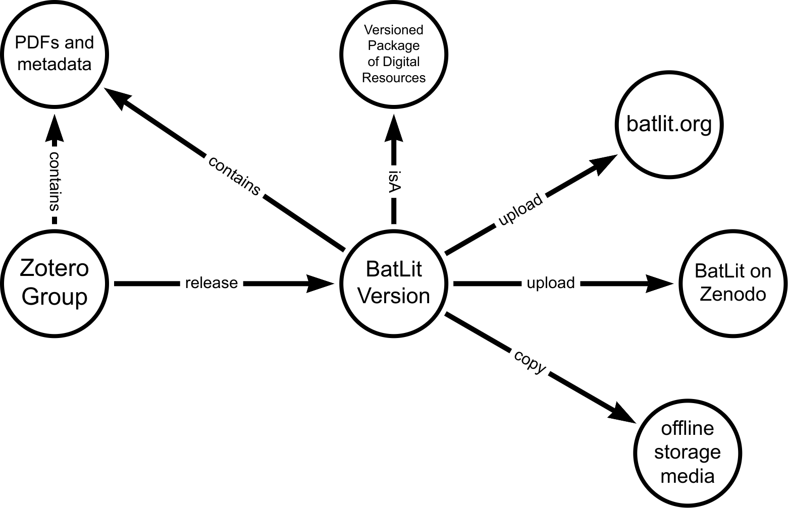
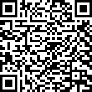

---
author:
  - Jorrit Poelen (UC Santa Barbara, Ronin Institute)
  - Aja C. Sherman (Bat Eco-Interactions Project)
  - Anna Willoughby (University of Georgia, Athens, GA, US)
  - Donat Agosti (Plazi)
  - Nancy B. Simmons (American Museum of Natural History)
  - Nathan S. Upham (Arizona State University)
  - Cullen Geiselman (Bat Eco-Interactions Project)
title: "BatLit.org - Mobilizing Bat Literature"
subtitle: "through existing Collaborations, platforms, and open source tools"
date: 2024-10-25
aspectratio: 169
---

## Guiding Questions

### How do *you* access/reuse literature collection?

### How do *you* organize your literature collection?

### How do *you* share your literature collection?

##  

## Andersen, 1912: An Influential Bat Work

Andersen, K.C. 1912. Catalogue of the Chiroptera in the collection of the British Museum. Volume I: Megachiroptera. British Museum (Natural History), British Museum Catalogue, 854 pp. https://www.biodiversitylibrary.org/part/91323. 

## Finding Andersen, 1912

{height=75%}

## Finding Andersen, 1912

{height=75%}

## Finding Andersen, 1912 

Like this?

{height=75%}

## Finding Anderson, 1912

Or, like this?

{height=75%}

## Finding Anderson, 1912

Or perhaps like this?

{height=75%}

## Finding Anderson, 1912 

{height=75%}

## Finding Andersen, 1912

{height=75%}

## Finding Andersen, 1912 

{height=75%}

## Finding Anderson, 1912

So, some webpage

... at https://zenodo.org/records/13517334 ... 

... as accessed on 2024-10-22

... claims that Anderson, 1912

... is associated with a digital fingerprint

... <hash://md5/56384a6778e2c67bbd8ebe4d63f770cf>

... that uniquely identifies a "physical" digital copy

... of the seminal Andersen, 1912 work.

## Found Andersen, 1912 at 30,000 ft

(screenshot made of Jorrit's laptop screen at 30,000 ft on UA6135 IAH to GDL on 2024-10-22 using: Sherman, A.C. et al 2024. BatLit.org v0.6 hash://md5/db73e659e8cf16ef50e82bb5e72ae97b)

## Found Andersen, 1912!

Note to self: next time, add a **digital content fingerprint** to identify the *exact* digital copy of Anderson, 1912 you'd like to reference.

## Citing Andersen, 1912 pre-Internet

Andersen, K.C. 1912. Catalogue of the Chiroptera in the collection of the British Museum. Volume I: Megachiroptera. British Museum (Natural History), British Museum Catalogue, 854 pp.

## Citing Andersen, 1912 in the Age of the Internet

(with internet locations)

Andersen, K.C. 1912. Catalogue of the Chiroptera in the collection of the British Museum. Volume I: Megachiroptera. British Museum (Natural History), British Museum Catalogue, 854 pp. **https://www.biodiversitylibrary.org/part/91323** **https://doi.org/10.5962/bhl.title.8322**

## Citing Andersen, 1912: Beyond the Internet

(with internet locations and non-internet identifiers)

Andersen, K.C. 1912. Catalogue of the Chiroptera in the collection of the British Museum. Volume I: Megachiroptera. British Museum (Natural History), British Museum Catalogue, 854 pp. https://www.biodiversitylibrary.org/part/91323 https://doi.org/10.5962/bhl.title.8322 **hash://md5/56384a6778e2c67bbd8ebe4d63f770cf** ^[Elliott M.J., Poelen, J.H. & Fortes, J.A.B. (2023) Signing data citations enables data verification and citation persistence. *Sci Data*. https://doi.org/10.1038/s41597-023-02230-y [hash://sha256/f849c870565f608899f183ca261365dce9c9f1c5441b1c779e0db49df9c2a19d](https://linker.bio/hash://sha256/f849c870565f608899f183ca261365dce9c9f1c5441b1c779e0db49df9c2a19d)]

## How Was Jorrit Able to Access This Paper at 30,000 ft?

{height=75%}

## How Was Jorrit Able to Access This Paper at 30,000 ft?

{height=75%}

## How Was Jorrit Able to Access This Paper at 30,000 ft?

{height=75%}

## Wishing you had 20k bat papers at your fingertips? 

{height=75%}

## BatLit Bits and Pieces

{height=75%}

## BatLit Versions

| version | date | size | # pages | # references | fingerprint |
| --- | --- | --- | --- | --- | --- |
| v0.6 | 2024-09-19 | 44.7GiB | 427,105 | **19,038** | {height=15%} |
| v0.5 | 2024-08-16 | 50.9 GiB | | 20,145 | {height=15%} |  
| ... | ... | ...  | ... | ... | {height=15%} |  
| v0.1 | 2024-04-26 | 7.9 GiB | | 2,929 | {height=15%} |  

## How Was Jorrit Able to Access Andersen, 1912?

Through Work of CETAF/GBatNet Eco-Interactions working group activities spanning 4.5 years in which:
 
 * goals were identified
    * (G1) make bat interaction data digitally accessible,
    * (G2) align bat taxonomic names to uncover their meaning, and
    * (G3) provide open-access to bat literature. 
 * Plazi provided a legal framework via their Biodiversity Literature Repository ^[https://plazi.org, https://zenodo.org/communities/biosyslit/records].
 * BatBase ^[Bat Eco-Interactions Project, https://batbase.org] provided curatorial support.
 * Jorrit reused open source software ^[https://github.com/bio-guoda/preston] to track, package and version bat literature metadata and their pdfs.
 * Researchers like you shared their literature collections.

## Next Steps

### Further develop governance model to help sustain BatLit.

### Improve BatLit depth, mobility, and access for the benefit of the bat research community. 

### Use BatLit as a digital foundation for associated projects.

## Want to know more? 

Visit https://batlit.org, or chat/reach out to members of the GBatNet Eco-Interactions working group (in no particular order): 

Aja Sherman, Nancy Simmons, DeeAnn Reeder, Nathan Upham, Cullen Geiselman, Cecilia Montauban, Hernani Oliveira, Ariadna Morales, Jelle Zijlstra, Quentin Groom, Donat Agosti, Kendra Phelps, Anna Willoughby, or Jorrit Poelen. 

## Thank you / Acknowledgments

### BatLit would not have been possible without the tremendous amount of work done by you, your fellow bat researchers, and those that proceeded us. 

## Guiding Questions

### How do *you* access/reuse literature collection?

### How do *you* organize your literature collection?

### How do *you* share your literature collection?

## Extra 

## BatLit Workflow

## BatLit Workflow Steps

 1. Curator Adds Digital Copy to BatLit Project on Zotero ^[https://www.zotero.org/groups/5435545/bat_literature_project]
 2. Periodically, Archivist takes a snapshot of all Zotero records in BatLit, including bibliographic metadata and the "physical" digital copy (pdf).
 3. Archivist puts the snapshots in a signed digital archive (box) and signs the provenance logs
 4. Signed Digital Archive (or a batlit corpus version) is mobilized by translating and upload them to Zenodo, GitHub Pages, and various other network attached storage media
 5. Signed Digital Archives is stored on offline enabled media (sd card, external hard disk)
 6. Corpus is transmitted and discovered by students researchers
 6. Corpus is reused by students and researchers, enabling both manual (e.g., reading, annotation) and automated (e.g., raw material for language model training) workflows  
 7. Reuse promotes improvement and further awareness

## Accessing content associated with DOIs

Take 2. 

 * turn on the internet (still there?)
 * open a web browser
 * load https://doi.org/10.5962/bhl.title.8322
   * and rely on a delicate and complex socio-technical network 
 * inspect page
 * use mouse to click on a link that looks like a bug picture
 * download image and **trust** its authenticity

## DOI Economics and Redirection

## Internet Is Designed For *Exchanging* Information 

> The internet is a powerful tool for exchanging digital information. But the Internet’s contents changes constantly: websites are launched and taken down, webpages change, and content gets archived or lost.^[Jorrit Poelen. 2024. Unleashing Digital Knowledge Into The Future. Accessed on 2024-02-06 at https://linker.bio [line:hash://sha256/8ac18eb75ff20d40d1d60bb6ad5a745eb528093d1ffbe373e3847c13146091eb!/L12](https://linker.bio/line:hash://sha256/8ac18eb75ff20d40d1d60bb6ad5a745eb528093d1ffbe373e3847c13146091eb!/L12)]

---

## Internet Is *Location-based*

> By design, a web address, or Uniform Resource Locator (URL), points to a specific internet location from which a resource, like a webpage, can be retrieved. However, a URL does not provide a way to verify that a retrieved webpage was the one we asked for. ^[Jorrit Poelen. 2024. Unleashing Digital Knowledge Into The Future. Accessed on 2024-02-06 at https://linker.bio [line:hash://sha256/8ac18eb75ff20d40d1d60bb6ad5a745eb528093d1ffbe373e3847c13146091eb!/L14](https://linker.bio/line:hash://sha256/8ac18eb75ff20d40d1d60bb6ad5a745eb528093d1ffbe373e3847c13146091eb!/L14)]

---

## Finding Content By Their Location Is ... Tricky

> Imagine using a URL-like reference to find a book at a library: instead of locating a book by what it is (e.g., title, author), you refer to a book by its location (e.g., third shelf on the second row next to the window). With this, a book becomes unfindable if moved to another shelf. And, if you do manage to find a book at the referenced location, how would you know you’ve found the book you are looking for? ^[Jorrit Poelen. 2024. Unleashing Digital Knowledge Into The Future. Accessed on 2024-02-06 at https://linker.bio [line:hash://sha256/8ac18eb75ff20d40d1d60bb6ad5a745eb528093d1ffbe373e3847c13146091eb!/L16](https://linker.bio/line:hash://sha256/8ac18eb75ff20d40d1d60bb6ad5a745eb528093d1ffbe373e3847c13146091eb!/L16)]

---

## Finding Content By Their (Summarized) Content Is ... What Librarians Do

> Instead of pointing to where books are located, librarians point to them using a bibliographic reference. For practical reasons, only a few identifying clues are included in such a reference (e.g., author, year of publication, title, and publisher). **So, librarians refer to content by what it is, and knowing where it may be located is secondary.** ^[Jorrit Poelen. 2024. Unleashing Digital Knowledge Into The Future. Accessed on 2024-02-06 at https://linker.bio [line:hash://sha256/8ac18eb75ff20d40d1d60bb6ad5a745eb528093d1ffbe373e3847c13146091eb!/L18](https://linker.bio/line:hash://sha256/8ac18eb75ff20d40d1d60bb6ad5a745eb528093d1ffbe373e3847c13146091eb!/L18)]
