## Guiding Questions

 * How do *you* access/reuse literature collection?
 * How do *you* organize your literature collection?
 * How do *you* share your literature collection?

## Is there a Worthy Bat Book Out There?

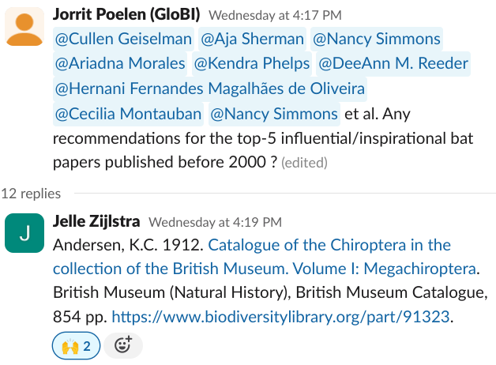

## Yes, There's a Bat Book Out There...

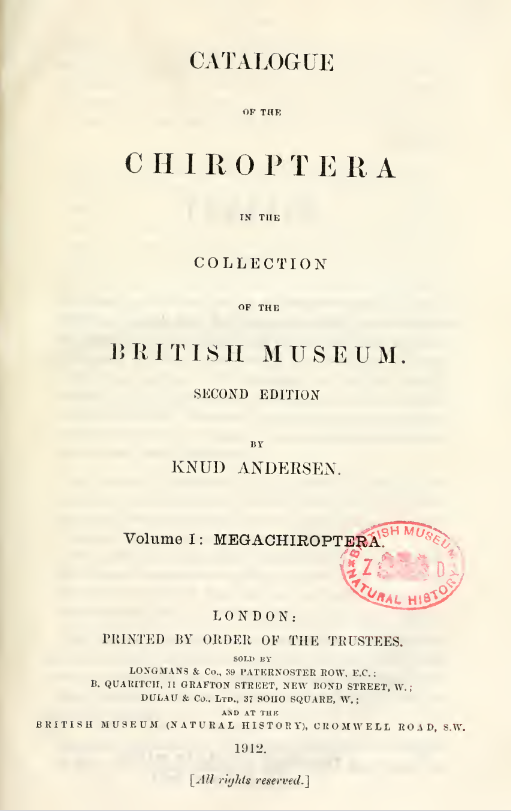


## So How'd You Cite This Book?

> Andersen, K.C. 1912. Catalogue of the Chiroptera in the collection of the British Museum. Volume I: Megachiroptera. British Museum (Natural History), British Museum Catalogue, 854 pp. https://www.biodiversitylibrary.org/part/91323. 

## How to Access This Paper?

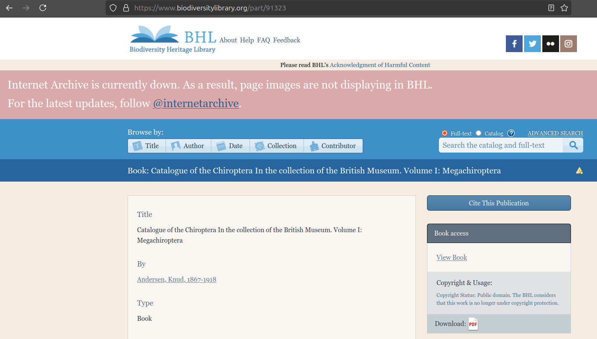

## How to Access This Paper?

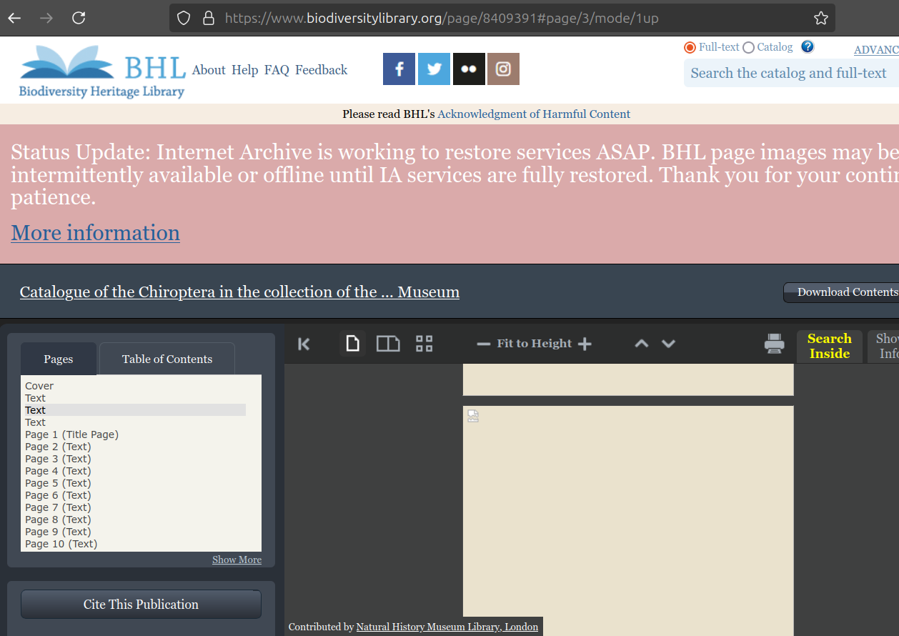

## How to Access This Paper?

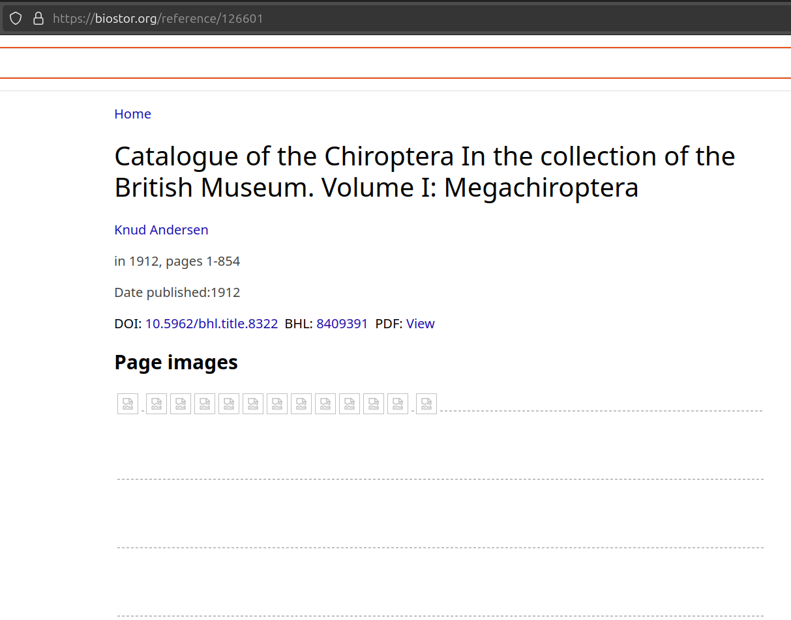

## How To Access This Paper?

Like this?

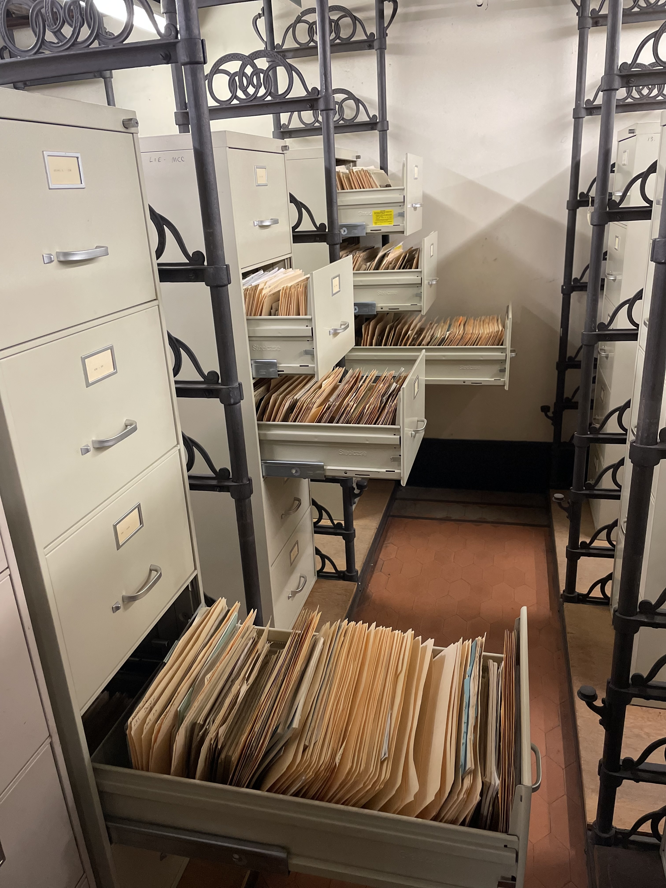

## How To Access This Paper?

Or, like this?

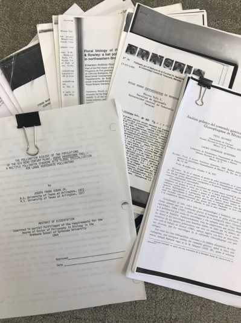

## How To Access This Paper?

Or perhaps like this?


## How To Access This Paper? 

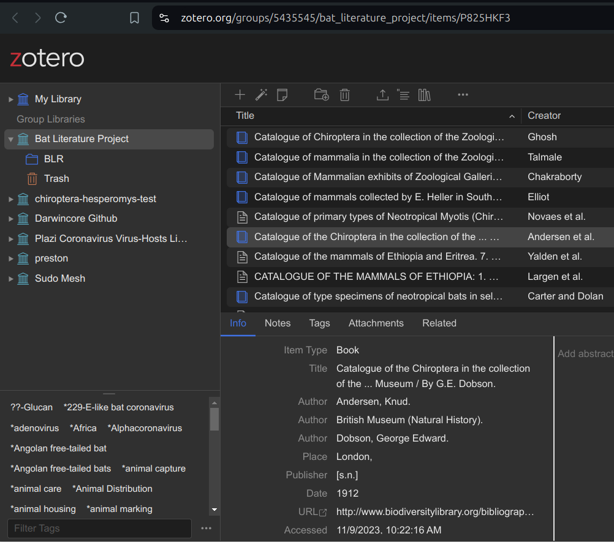

## How to Access This Paper?

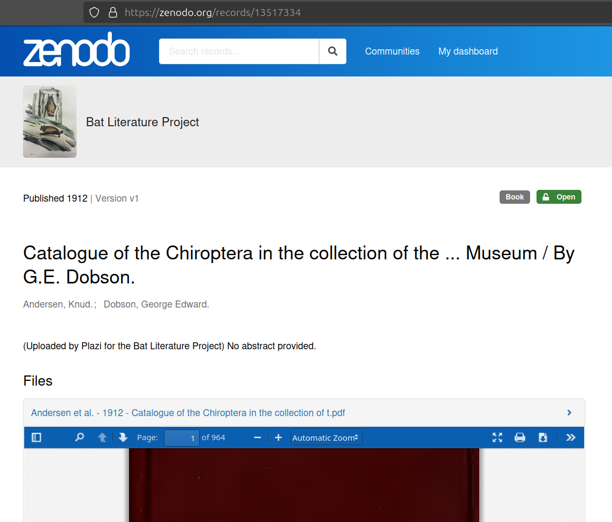

## How to Access This Paper? 

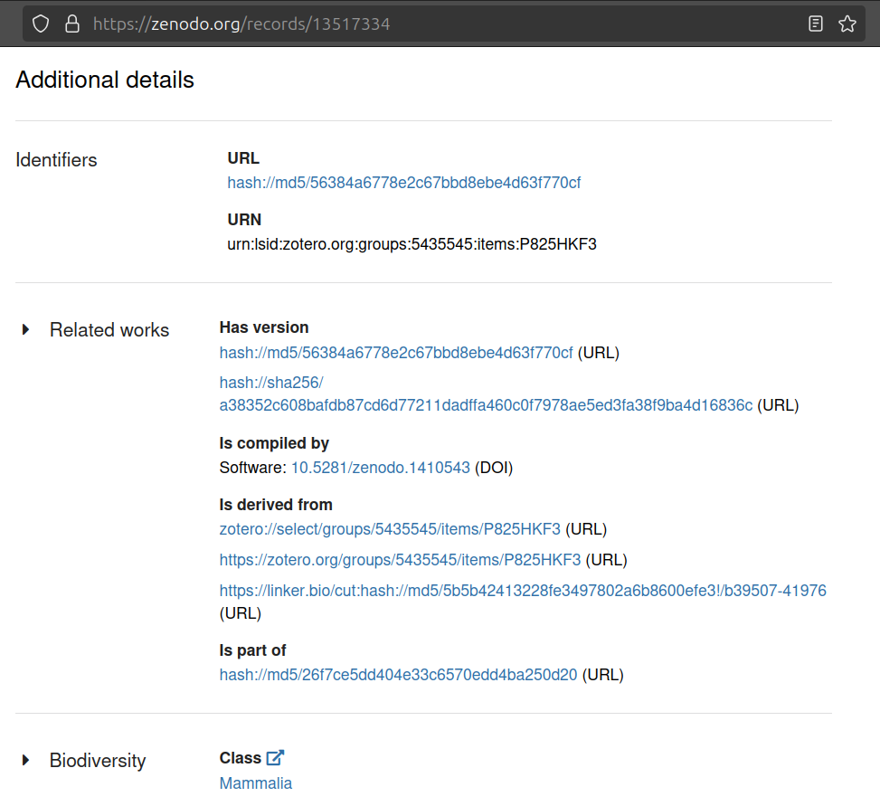

## How to Access This Paper?

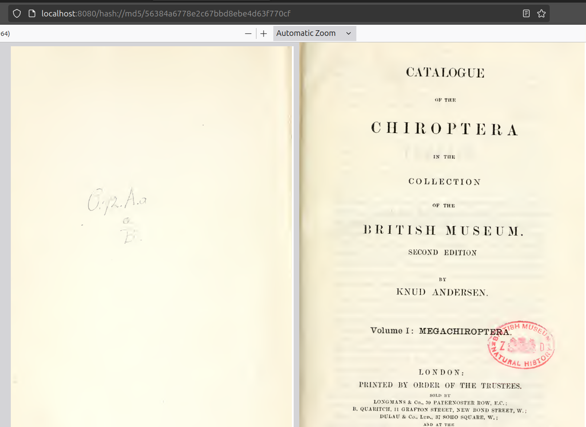

## How Was Jorrit Able to Access This Paper at 30k ft?

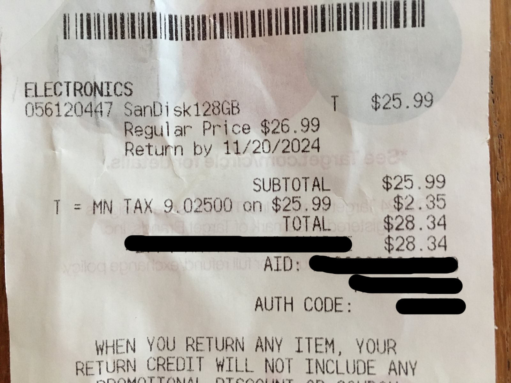


## How Was Jorrit Able to Access This Paper at 30k ft?

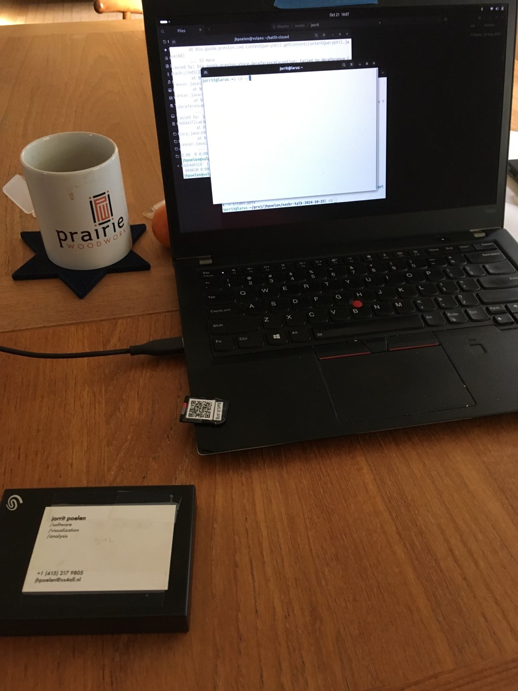

## How Was Jorrit Able to Access This Paper at 30k ft?

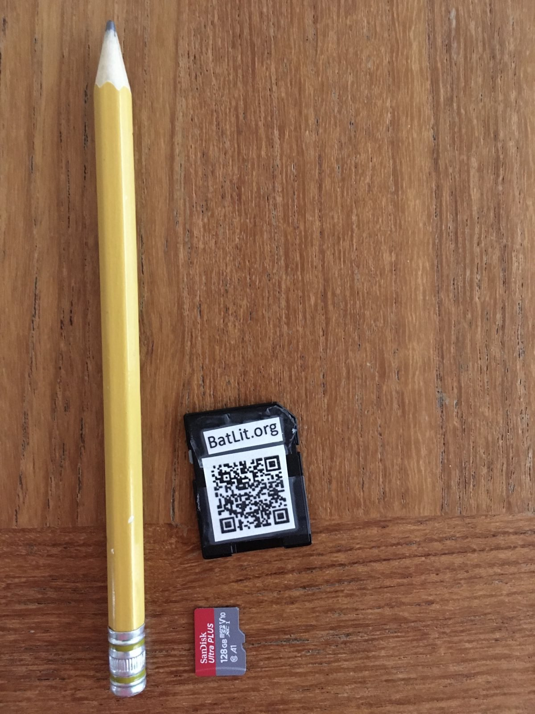


## Wishing you had 20k bat papers at your fingertips? 

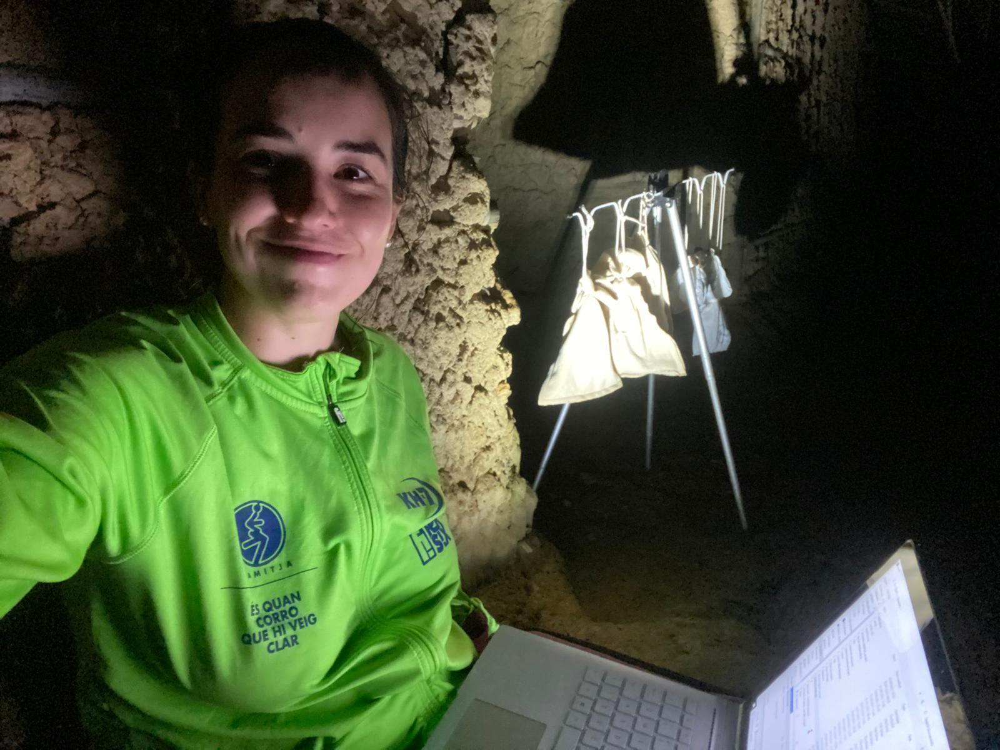

## BatLit 20k papers / <64 GB

### 20k Papers

### < 64GB 


| version | date | size | # pages | # references | # attachments | fingerprint |
| --- | --- | --- | --- | --- | --- |
 | v0.1 | 2024-04-26 | 7.9 GiB | | 2929 | 5055 | [hash://sha256/6ba...189](https://linker.bio/hash://sha256/6ba3d79cf1fd6349012cb4e527b6727b3e41e140489fa9c02f132e2cdd88d189) |  
| v0.2 | 2024-05-16/2024-05-17 | 11.6 GiB | | 3310 | 5471 | [hash://md5/be6...1d7](https://linker.bio/hash://md5/be692b93a8edde4c4269be9e7d4ec1d7) |  
| v0.3 | 2024-06-25/2024-06-26 | 13.6 GiB | | 5501 | 7229 | [hash://md5/350...77d](https://linker.bio/hash://md5/350f87ae6b68b96bec135c1d6ebac77d) |  
| v0.4 | 2024-08-01/2024-08-02 | 50.9 GiB | | 20146 | 29860 | [hash://md5/b39...72a](https://linker.bio/hash://md5/b394bdb081f55916b1226b5bc8ba972a) |  
| v0.5 | 2024-08-16/2024-08-17 | 50.9 GiB | | 20145 | 29850 | [hash://md5/26f...b20](https://linker.bio/hash://md5/26f7ce5dd404e33c6570edd4ba250d20) |  
| v0.6 | 2024-09-19/2024-09-20 | 44.7GiB | 427105 | 19038 | 22590 | [hash://md5/db7...97b](https://linker.bio/hash://md5/db73e659e8cf16ef50e82bb5e72ae97b) | 


## How Was Jorrit Able to Access This Paper Now?

Work with GBatNet group for 3.5 years in which:
 
 * goals were identified
    * (G1) make bat interaction data digitally accessible,
    * (G2) align bat taxonomic names to uncover their meaning, and
    * (G3) provide open-access to bat literature. 
 * Plazi provided a legal framework ^[needs citation]
 * BatBase provided curatorial support 
 * Jorrit reused work done in tracking, packaging and versioning biodiversity datsets 
 * Collectors/researchers shared their literature collections

## BatLit Workflow

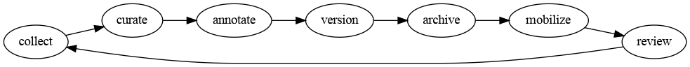


## Introducing BatLit

 1. Curator Adds Digital Copy to BatLit Project on Zotero ^[https://www.zotero.org/groups/5435545/bat_literature_project]
 2. Periodically, Archivist takes a snapshot of all Zotero records in BatLit, including bibliographic metadata and the "physical" digital copy (pdf).
 3. Archivist puts the snapshots in a signed digital archive (box) and signs the provenance logs
 4. Signed Digital Archive (or a batlit corpus version) is mobilized by translating and upload them to Zenodo, GitHub Pages, and various other network attached storage media
 5. Signed Digital Archives is stored on offline enabled media (sd card, external hard disk)
 6. Corpus is transmitted and discovered by students researchers
 6. Corpus is reused by students and researchers, enabling both manual (e.g., reading, annotation) and automated (e.g., raw material for language model training) workflows  
 7. Reuse promotes improvement and further awareness

## How To Access This Paper Now?

Take 2. 

 * turn on the internet (still there?)
 * open a web browser
 * load https://doi.org/10.5281/zenodo.13342373
   * and rely on a delicate and complex socio-technical network 
 * inspect page
 * use mouse to click on a link that looks like a bug picture
 * download image and **trust** its authenticity

## DOI Economics and Redirection

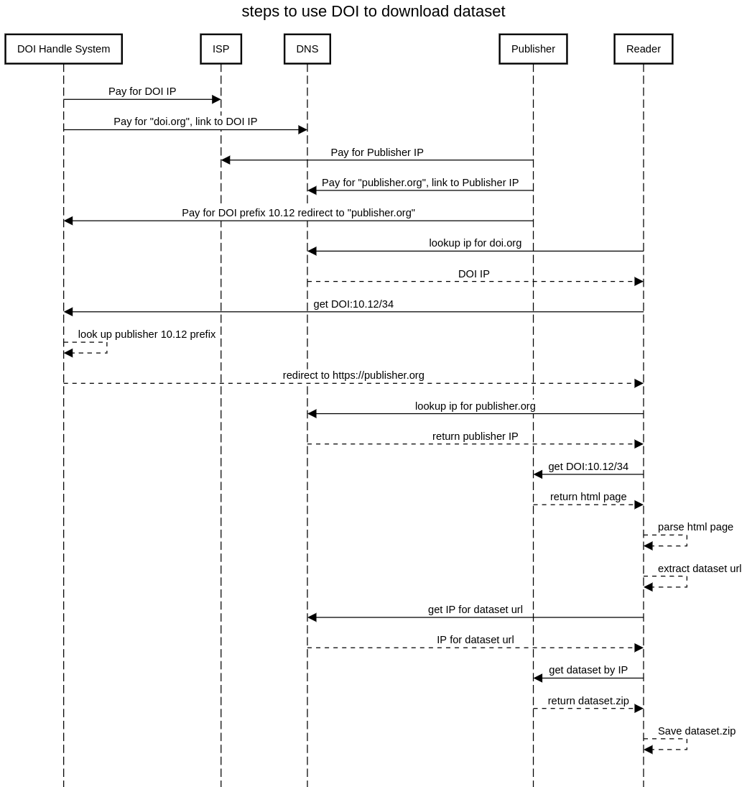

## How To Retrieve This Bug Picture 40 Years From Now?

Andersen, K.C. 1912. Catalogue of the Chiroptera in the collection of the British Museum. Volume I: Megachiroptera. British Museum (Natural History), British Museum Catalogue, 854 pp. https://www.biodiversitylibrary.org/part/91323 https://doi.org/10.5962/bhl.title.8322

Likely will not work due to intricate network of dependencies.

## How To Access This Paper 40 Years From Now?

### Proposal: Sign the citation ^[Elliott M.J., Poelen, J.H. & Fortes, J.A.B. (2023) Signing data citations enables data verification and citation persistence. *Sci Data*. https://doi.org/10.1038/s41597-023-02230-y [hash://sha256/f849c870565f608899f183ca261365dce9c9f1c5441b1c779e0db49df9c2a19d](https://linker.bio/hash://sha256/f849c870565f608899f183ca261365dce9c9f1c5441b1c779e0db49df9c2a19d)] 

... by adding some digital fingerprints of the "physical" digital copy and the corpus (manifest) they are a part of.

Andersen, K.C. 1912. Catalogue of the Chiroptera in the collection of the British Museum. Volume I: Megachiroptera. British Museum (Natural History), British Museum Catalogue, 854 pp. https://www.biodiversitylibrary.org/part/91323 https://doi.org/10.5962/bhl.title.8322 **```<hash://md5/db73e659e8cf16ef50e82bb5e72ae97b> <http://www.w3.org/ns/prov:hadMember> <hash://md5/56384a6778e2c67bbd8ebe4d63f770cf> .```**

## How To Access This Paper 40 Years From Now?


... by searching the world (in, and beyond, the internet) for the content with the unique fingerprint hash://md5/f052cbac398bf340a620c421bfefa16d .

 * https://linker.bio/hash://md5/f052cbac398bf340a620c421bfefa16d
 * https://zenodo.org/records/13342373/files/BMT121_BMT0009388_stacked_01.tiff
 * ```preston cat --remote https://zenodo.org hash://md5/f052cbac398bf340a620c421bfefa16d```
 * ```preston cat --remote https://softwareheritage.org hash://sha256/69df9b5bc5df5619448ade01c92d0a5e20bcec2ab4c8b668d2db56f9e5cce6e7```
 * ```preston cat --remote https://linker.bio,https://zenodo.org hash://md5/f052cbac398bf340a620c421bfefa16d```
 
## Let Us Carry Our Papers Into The Future...

```
preston cat\
 --remote "https://zenodo.org"\
 hash://md5/f052cbac398bf340a620c421bfefa16d\
 > bug.tiff
```


---

## Guiding Questions

 * How do *you* access literature?
 * How do *you* organize your literature?
 * How do *you* share your literature?

---

## Extra

---

## Internet Is Designed For *Exchanging* Information 

> The internet is a powerful tool for exchanging digital information. But the Internet’s contents changes constantly: websites are launched and taken down, webpages change, and content gets archived or lost.^[Jorrit Poelen. 2024. Unleashing Digital Knowledge Into The Future. Accessed on 2024-02-06 at https://linker.bio [line:hash://sha256/8ac18eb75ff20d40d1d60bb6ad5a745eb528093d1ffbe373e3847c13146091eb!/L12](https://linker.bio/line:hash://sha256/8ac18eb75ff20d40d1d60bb6ad5a745eb528093d1ffbe373e3847c13146091eb!/L12)]

---

## Internet Is *Location-based*

> By design, a web address, or Uniform Resource Locator (URL), points to a specific internet location from which a resource, like a webpage, can be retrieved. However, a URL does not provide a way to verify that a retrieved webpage was the one we asked for. ^[Jorrit Poelen. 2024. Unleashing Digital Knowledge Into The Future. Accessed on 2024-02-06 at https://linker.bio [line:hash://sha256/8ac18eb75ff20d40d1d60bb6ad5a745eb528093d1ffbe373e3847c13146091eb!/L14](https://linker.bio/line:hash://sha256/8ac18eb75ff20d40d1d60bb6ad5a745eb528093d1ffbe373e3847c13146091eb!/L14)]

---

## Finding Content By Their Location Is ... Tricky

> Imagine using a URL-like reference to find a book at a library: instead of locating a book by what it is (e.g., title, author), you refer to a book by its location (e.g., third shelf on the second row next to the window). With this, a book becomes unfindable if moved to another shelf. And, if you do manage to find a book at the referenced location, how would you know you’ve found the book you are looking for? ^[Jorrit Poelen. 2024. Unleashing Digital Knowledge Into The Future. Accessed on 2024-02-06 at https://linker.bio [line:hash://sha256/8ac18eb75ff20d40d1d60bb6ad5a745eb528093d1ffbe373e3847c13146091eb!/L16](https://linker.bio/line:hash://sha256/8ac18eb75ff20d40d1d60bb6ad5a745eb528093d1ffbe373e3847c13146091eb!/L16)]


---

## Finding Content By Their (Summarized) Content Is ... What Librarians Do

> Instead of pointing to where books are located, librarians point to them using a bibliographic reference. For practical reasons, only a few identifying clues are included in such a reference (e.g., author, year of publication, title, and publisher). **So, librarians refer to content by what it is, and knowing where it may be located is secondary.** ^[Jorrit Poelen. 2024. Unleashing Digital Knowledge Into The Future. Accessed on 2024-02-06 at https://linker.bio [line:hash://sha256/8ac18eb75ff20d40d1d60bb6ad5a745eb528093d1ffbe373e3847c13146091eb!/L18](https://linker.bio/line:hash://sha256/8ac18eb75ff20d40d1d60bb6ad5a745eb528093d1ffbe373e3847c13146091eb!/L18)]


A bibliographic citation:

Darwin, C. 1859. On the Origin of Species. John Murray.

---


